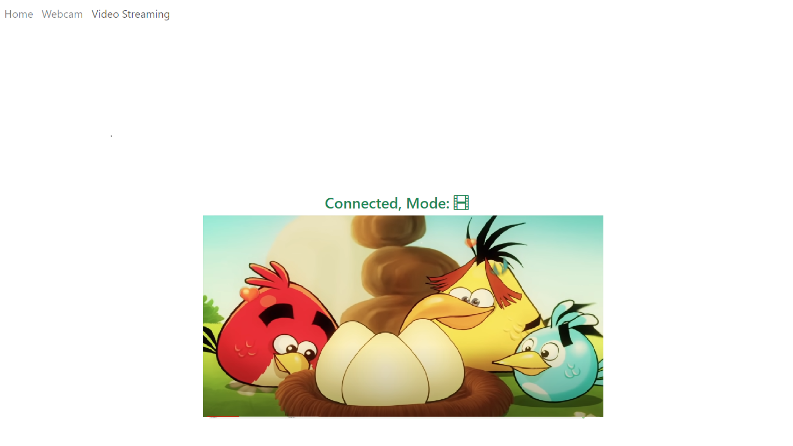
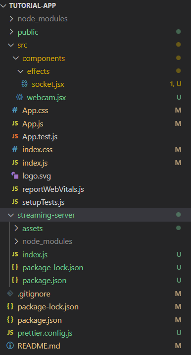

# Video streaming app


### Description

This app aims to demonstrate the possibilities of streaming live captures from a source device or rendering a recorded video through a stream of frames.



### Files structure


***/src/*** folder is holding the front end part responsible for the representation, this is a small app created using React Framework.

***/streaming-server/*** is the folder containing the backend business logic, the reading of a video or a capturing device, sampling into frames and sending to the presentation layer is done here.

### Architecture


```sequence
Frontend->Backend: Tries to connect to the backend via a Websocket
Note right of Backend: Approves
Backend-->Frontend: Connected!
Frontend->Backend: Sends 'live' or 'video' in the websocket
Note right of Backend: Reads frames from the source (File, Video device)
Backend->Frontend: Sends back the Base64 encoded string for the frame
Note left of Frontend: Renders the incomming string in an img element
Note left of Frontend: Waits for the next frame
```

#### Backend Snippet code:
 
    const cv2 = require('opencv4nodejs');
    const FPS = 30;
    
    const videoReader = new cv2.VideoCapture('./assets/Media1.mp4');
    videoReader.set(cv2.CAP_PROP_FRAME_WIDTH, 300);
    videoReader.set(cv2.CAP_PROP_FRAME_HEIGHT, 300);
    
    interval2 = setInterval(() => {
    		const frame = videoReader.read();
    		if(!frame.empty) {
    			const image = cv2.imencode('.jpg', frame).toString('base64');
    			connection.send(image);
    		} else {
    			videoReader.release();
    			videoReader.reset();
    			clearInterval(interval2);
    		}
    }, 1000 / FPS);


------------


>  #### I choosed opencv4nodejs as a quick start PoC library for its simplicity & robustness.

It is easy to access the frame of a video source as shown in the snippet before. After that I set an interval that depends on the FPS wished for. In a live camera scenario, there is no ending condition since the streaming is unlimited, while on a specific video file, there is a condition to check if the video has ended, in which basically we receive empty frames, and there we should stop sending and quitting the interval function.

- In a live camera scenario, there is no ending condition since the streaming is unlimited.
- While on a specific video file, there is a condition to check if the video has ended, in which basically we receive empty frames, and there we should stop sending and quitting the interval function.

## How to run the demo:
### 1.  Run the Backend server
in the root folder run the following commands:

```bash
cd ./streaming-server
node index.js
```
The streaming server will run by default under: [ws://localhost:3030](ws://localhost:3030)

### 2.  Run the Demo App
in the root folder run the following commands:

```bash
npm start
```
or 
```bash
react-scripts start
```
Runs the app in the development mode.\
Open [http://localhost:3000](http://localhost:3000) to view it in your browser.

The page will reload when you make changes.\
You may also see any lint errors in the console.

 ----------------
When both parts are served, you can navigate through the functionnalities of the app.
